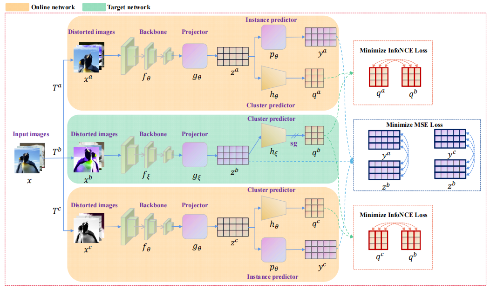

# Triplet Network for Contrastive deep Clustering (TNCC)

By Xiaozhi Deng, Dong Huang, Bowen Zhu, Ding-Hua Chen

This is a Pytorch implementation of the paper.

## Performance

The representation encoder of the proposed SACC is ResNet34.

|    Dataset    | NMI  | ACC  | ARI  |
| :-----------: | :--: | :--: | :--: |
|   CIFAR-100   | 46.5 | 47.2 | 30.5 |
|  ImageNet-10  | 87.5 | 90.5 | 83.9 |
| ImageNet-dogs | 49.4 | 49.3 | 35.2 |
| Tiny-ImageNet | 35.6 | 16.0 | 7.6  |

## Dependency

- python>=3.7
- pytorch>=1.6.0
- torchvision>=0.8.1
- munkres>=1.1.4
- numpy>=1.19.2
- opencv-python>=4.4.0.46
- pyyaml>=5.3.1
- scikit-learn>=0.23.2
- cudatoolkit>=11.0

## Configuration

There is a configuration file "config/config.yaml", where one can edit both the training and test options.

## Acknowledgment for reference repos

- [CC](https://github.com/Yunfan-Li/Contrastive-Clustering)

- [BYOL](https://github.com/Spijkervet/BYOL)

